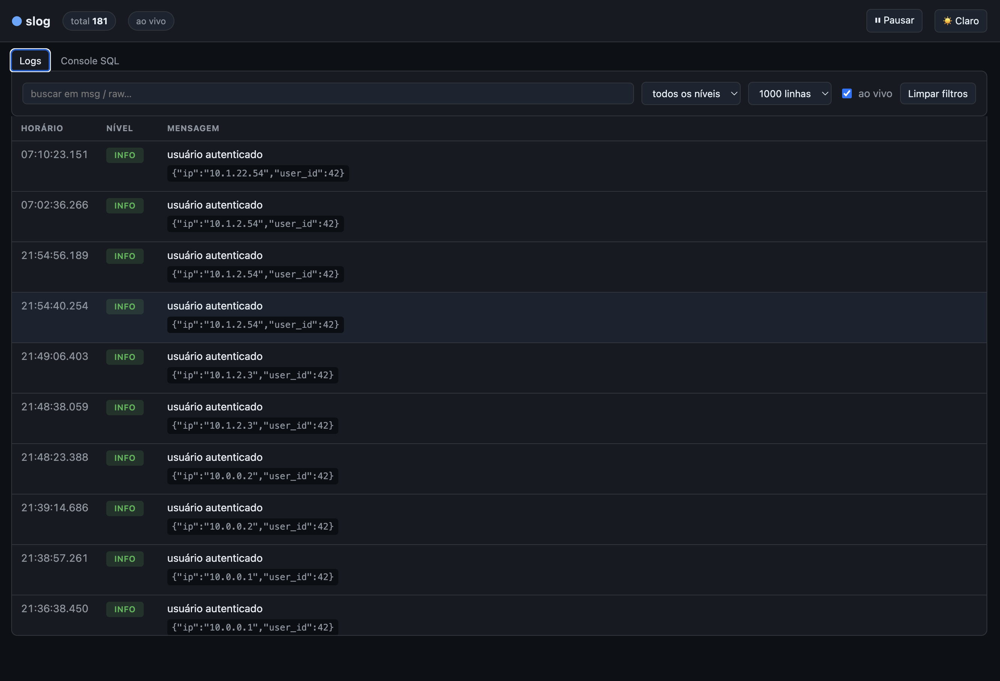
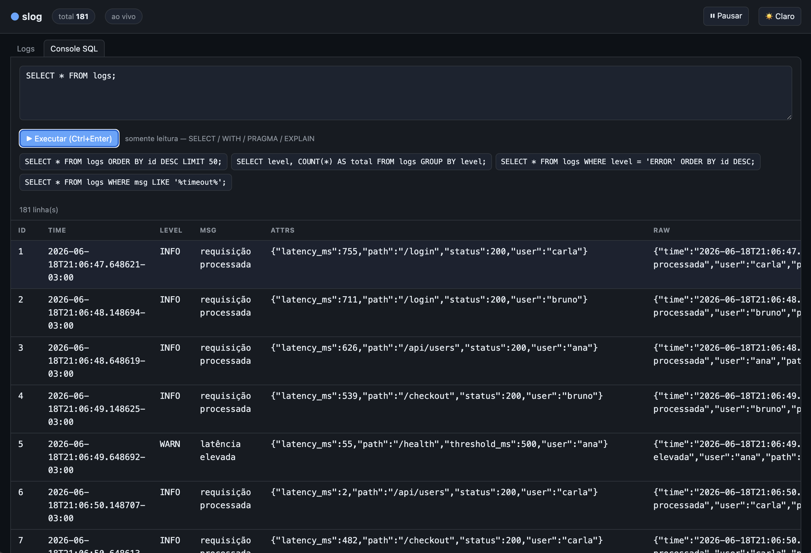

# slog

Lê logs em JSON do **stdin** e os persiste em um banco **SQLite**. Pensado para
capturar a saída estruturada de um processo via pipe Unix.

## Instalação

Para instalar o comando `slog` na máquina (disponível em qualquer diretório):

```sh
make install
```

Isso roda `go install ./cmd/slog`, que coloca o binário em `$(go env GOBIN)`
(ou `$(go env GOPATH)/bin` quando `GOBIN` não está definido). Garanta que esse
diretório esteja no seu `PATH`:

```sh
export PATH="$PATH:$(go env GOPATH)/bin"   # adicione ao seu ~/.zshrc ou ~/.bashrc
```

Depois disso, basta usar o comando direto:

```sh
meu-app | slog -db logs.db
```

Para remover: `make uninstall`.

## Comandos do Makefile

| Comando          | Descrição                                                   |
|------------------|-------------------------------------------------------------|
| `make build`     | Compila o binário em `./bin/slog`                           |
| `make run`       | Compila e executa (use `ARGS="..."` para passar flags)      |
| `make install`   | Instala o comando `slog` na máquina (em `$(GOBIN)`)         |
| `make uninstall` | Remove o comando `slog` instalado                           |
| `make test`      | Roda os testes                                              |
| `make tidy`      | Sincroniza as dependências (`go mod tidy`)                  |
| `make clean`     | Remove binários e bancos de logs gerados                    |
| `make db-clear`  | Remove os arquivos `.db` do diretório atual (`ARGS="-f"` para não confirmar) |
| `make help`      | Lista os comandos disponíveis                               |

```sh
# compila e executa passando flags
make run ARGS="-db logs.db -web :9000"
```

## Como usar

```sh
make build   # gera ./bin/slog

# captura os logs de um app que escreve JSON no stdout
meu-app | ./bin/slog -db logs.db

# também repassa as linhas adiante no pipe
meu-app | ./bin/slog -echo | grep ERROR
```

Após `make install`, o comando fica disponível globalmente, sem o prefixo de
caminho:

```sh
meu-app | slog -db logs.db
```

### Flags

| Flag     | Padrão     | Descrição                                          |
|----------|------------|----------------------------------------------------|
| `-db`    | `logs.db`  | Caminho do arquivo SQLite                          |
| `-batch` | `100`      | Registros por gravação em lote                     |
| `-flush` | `1s`       | Tempo máximo antes de gravar um lote parcial       |
| `-echo`  | `false`    | Repassa cada linha para o stdout (passthrough)     |
| `-web`   | `:8080`    | Endereço da interface web (use `-web ""` para desligar) |

Encerra de forma limpa em `Ctrl+C` / `SIGTERM`, gravando o lote pendente.

### Subcomandos

```sh
# remove os arquivos .db (e -wal/-shm) do diretório atual; pede confirmação
slog db:clear

# apaga sem confirmar
slog db:clear -f

# procura em outro diretório
slog db:clear -dir ./dados
```

| Subcomando   | Flag    | Descrição                                          |
|--------------|---------|----------------------------------------------------|
| `db:clear`   | `-dir`  | Diretório onde procurar os `.db` (padrão `.`)      |
| `db:clear`   | `-f`    | Apaga sem pedir confirmação                        |

## Interface web

Junto com a ingestão, o `slog` sobe uma interface web (por padrão em
`http://localhost:8080`) para visualizar e consultar os logs em tempo real:

```sh
meu-app | ./slog -db logs.db          # UI em http://localhost:8080
meu-app | ./slog -db logs.db -web :9000   # outra porta
meu-app | ./slog -db logs.db -web ""      # sem interface web
```





Recursos:

- **Logs ao vivo** — a lista atualiza sozinha via *polling* incremental.
- **Filtros** — busca por texto (em `msg`/`raw`), por nível e limite de linhas.
- **Console SQL** — consultas arbitrárias de **somente leitura**
  (`SELECT` / `WITH` / `PRAGMA` / `EXPLAIN`); comandos de escrita são recusados.
- **Tema claro/escuro**, com a preferência salva no navegador.

A interface permanece no ar **após o EOF** do `stdin` (quando o processo de
origem termina), para você continuar inspecionando os logs — encerre com
`Ctrl+C`. Os assets (incluindo o Handlebars) são embutidos no binário, então
funciona offline, sem CDN.

> A UI dá acesso de leitura ao banco a quem alcançar a porta. Como é uma
> ferramenta de uso local, não há autenticação; evite expô-la na rede.

## Schema

Cada linha vira uma linha na tabela `logs`. Os campos `time`, `level` e `msg`
(convenção do `log/slog`) viram colunas próprias; os demais campos do JSON são
guardados como JSON em `attrs`. A linha original fica em `raw` — linhas que não
forem JSON válido são preservadas apenas em `raw`.

```sql
CREATE TABLE logs (
    id          INTEGER PRIMARY KEY AUTOINCREMENT,
    time        TEXT,
    level       TEXT,
    msg         TEXT,
    attrs       TEXT,   -- demais campos, como JSON
    raw         TEXT NOT NULL,
    ingested_at TEXT NOT NULL
);
```

### Consultando

```sh
sqlite3 logs.db "SELECT time, level, msg FROM logs WHERE level = 'ERROR';"

sqlite3 logs.db "SELECT * from logs"
```
